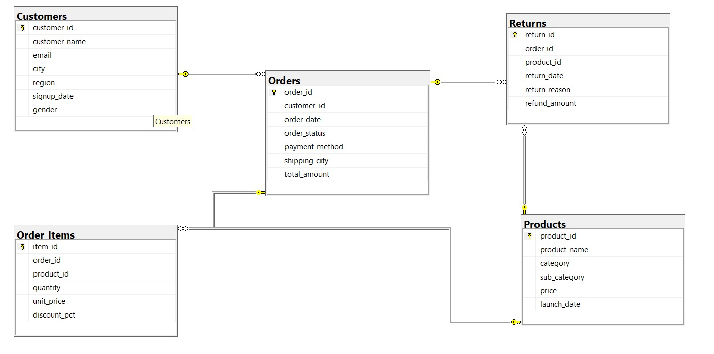
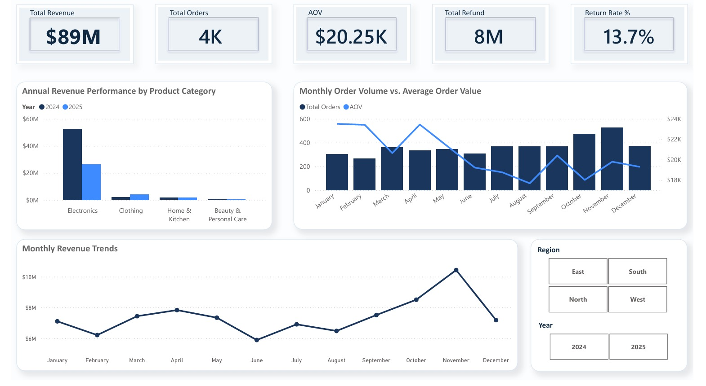
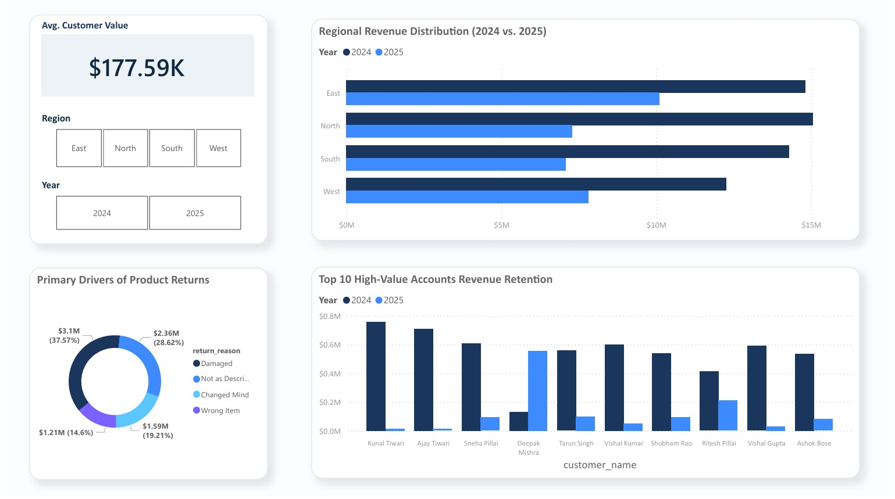
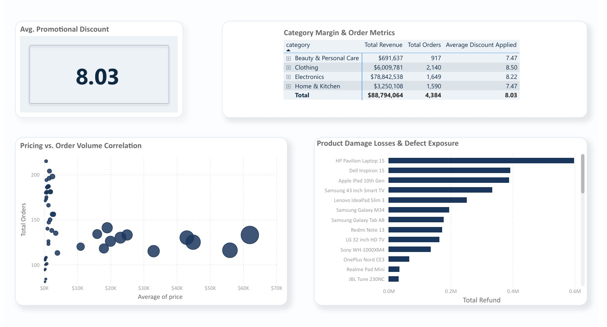

# ShopEase India — E-commerce Performance Analysis (2024–2025)
### *A data-driven audit of a $30M revenue decline and a strategic roadmap for recovery*

---

## 📌 Business Problem

ShopEase India, a multi-category e-commerce company operating across four regions, maintained stable transaction volumes throughout 2025 - yet total revenue declined by **$30 million**.

This created a **"Value Paradox"**: orders kept coming in, but the business was quietly losing value with every transaction.

The objective of this analysis was to:
- Identify the root causes behind the revenue decline
- Evaluate the impact of the category shift from Electronics to Clothing
- Understand why customer retention collapsed in the second half of 2025
- Provide data-backed recommendations to stabilise long-term performance

**Central Business Question:**
> *"Why is ShopEase India growing in order volume but losing revenue - and what should the business do about it?"*

---

## 🗂️ Dataset Overview

The dataset was synthetically generated to simulate realistic e-commerce business patterns, including seasonal spikes, a product line launch, a category decline, and a customer retention problem.

| Table | Rows | Description |
|---|---|---|
| Customers | 500 | Customer profiles across 4 regions and 20 Indian cities |
| Products | 50 | 4 categories including a new Clothing line launched March 2025 |
| Orders | 4,955 | Transactions spanning January 2024 - December 2025 |
| Order_Items | 8,200 | Product-level detail per order with quantity and discount |
| Returns | 600 | Returned items with reason and refund amount |

**Date Range:** January 2024 - December 2025  
**Business Story Baked In:** Electronics decline (Q2 2025), Clothing line launch (March 2025), festive season spike (Oct–Nov 2024), customer retention collapse (H2 2025)

### Database Schema



---

## 🔍 Key Findings

**1. The Value Paradox — Order volume held, but AOV collapsed by 50%**  
Customers kept placing orders throughout 2025, but the Average Order Value dropped by more than half compared to 2024. The business was busy but not profitable.

**2. Electronics Revenue Fell $26M — Nothing replaced the margin**  
Electronics revenue declined sharply from Q2 2025. Clothing revenue doubled during the same period, but Clothing operates on heavy discounts (8.5% average) making it a low-margin substitute for high-margin Electronics.

**3. 80% of Customers Are Loyal — But Top Spenders Are Pulling Back**  
The customer base looks healthy on the surface. However, top-tier customers in the North region reduced individual spending by nearly **$700K per customer** in 2025. The business is losing wallet share, not headcount.

**4. Electronics Return Rate Spiked to 22% in Q2–Q4 2025**  
Primary return reasons: Damaged (37.5%) and Not as Described (28.6%). This points to a logistics and supply chain failure, not a demand problem. The business lost approximately **$8M** in refunded Electronics revenue.

**5. The May 2025 Inflection Point — Revenue Never Recovered**  
A single-month drop of **$770K** in May 2025 marked the beginning of a sustained downward trend. Even the festive season recovery in October–November 2025 failed to reach 2024 levels.

---

## 📊 Analysis Tracks

The project is structured into four business-focused analysis tracks. Each track answers real business questions using specific SQL concepts.

---

### Track 1 - Time Series Analysis
**File:** `analysis/01_Time_Series_Analysis.sql`

| # | Business Question | SQL Concepts Used |
|---|---|---|
| Q1 | Monthly revenue trend across 2024 and 2025 | `GROUP BY`, `SUM()`, `YEAR()`, `MONTH()` |
| Q2 | Month-over-month revenue growth rate | `CTE`, `LAG()`, `OVER()`, `CAST()` |
| Q3 | Quarterly revenue comparison 2024 vs 2025 by category | `CTE`, `DATEPART()`, `LAG()` with `PARTITION BY` |
| Q4 | Average basket size and AOV by month | `CTE` (two-level aggregation), `AVG()` |

**Key Insight:** AOV in 2025 dropped to less than half of 2024 levels despite consistent order volume - the clearest signal of the Value Paradox.

---

### Track 2 - Customer Analysis
**File:** `analysis/02_Customer_Analysis.sql`

| # | Business Question | SQL Concepts Used |
|---|---|---|
| Q1 | Segment customers into New, Returning, Loyal | `CASE WHEN`, Subquery, `OVER()` for % |
| Q2 | Top 10 customers by lifetime revenue + segment | `CTE`, `CASE WHEN`, `RANK()` |
| Q3 | % of 2025 signups who never placed a second order | `LEFT JOIN`, `COUNT(CASE WHEN)`, Subquery in `FROM` |
| Q4 | Regional customer lifetime value comparison | `GROUP BY`, `SUM()`, `AVG()`, `JOIN` |

**Key Insight:** Nearly 80% of customers are Loyal - but top spenders in the North region reduced annual spending by $700K per customer. The business is losing wallet share, not customers.

---

### Track 3 - Product Analysis
**File:** `analysis/03_Product_Analysis.sql`

| # | Business Question | SQL Concepts Used |
|---|---|---|
| Q1 | Revenue share by category — 2024 vs 2025 shift | `CASE WHEN` inside `SUM()`, `OVER()` for share % |
| Q2 | Top 5 and bottom 5 products ranked within category | `DENSE_RANK()`, `PARTITION BY`, `CTE` |
| Q3 | New Clothing line monthly performance post-launch | `LAG()`, Date filters, `JOIN` across 3 tables |
| Q4 | Average discount by category vs net revenue impact | `AVG()`, Gross vs Net revenue calculation |

**Key Insight:** Electronics revenue share dropped from 35% in 2024 to 17% in 2025. Clothing doubled but growth was driven by 8.5% average discounts - trading high-margin sales for low-margin volume.

---

### Track 4 - Returns Analysis
**File:** `analysis/04_Return_Analysis.sql`

| # | Business Question | SQL Concepts Used |
|---|---|---|
| Q1 | Return rate and revenue loss by category | `LEFT JOIN`, `NULLIF()`, `COUNT()`, `SUM()` |
| Q2 | Most common return reasons by category | `GROUP BY`, `COUNT()`, `JOIN` |
| Q3 | Products with highest return rate — review or delist? | `CTE` with `HAVING`, `DENSE_RANK()`, reason breakdown |
| Q4 | Monthly refund trend in 2025 — is it worsening? | `LAG()`, `DATE` functions, `SUM()` |

**Key Insight:** Electronics return rate hit 22% in Q2–Q4 2025 - nearly 3x the 2024 baseline. "Damaged" items account for 37.5% of all returns. This is a logistics problem, not a product problem. Fix the supply chain, not the product.

---

## 💡 Business Recommendations

**1. Fix Logistics Before Delisting Electronics**  
Electronics demand exists - customers are buying but returning due to damage. Audit shipping partners and upgrade packaging. Recovering even half of the $8M Electronics return leakage would outperform any new product launch.

**2. Shift Clothing from Discount-Led to Quality-Led**  
Clothing growth is artificially inflated by 8.5% average discounting. "Changed Mind" returns indicate customers are buying on impulse and regretting it. Reduce discount depth and invest in better product photography and size guides to set accurate expectations.

**3. Delist High-Return, Low-Intent Products**  
Specific Clothing items with >12% return rates driven by "Changed Mind" should be phased out. These products generate volume but erode net revenue and customer trust simultaneously.

**4. Diversify Regional Focus Toward East**  
The North region concentrates the highest individual spenders - and they are pulling back. The East region holds the highest total Customer LTV ($24.9M) and represents the strongest growth hedge. Increase East-region marketing investment.

**5. Implement Warehouse Verification for "Wrong Item" Returns**  
Wrong Item returns are entirely avoidable - they are operational failures, not customer behaviour. A double-check system at fulfilment would eliminate this category of returns with zero product changes needed.

---

## 📊 Dashboard Visualizations

### Executive Performance Overview


### Customer & Regional Analysis


### Product & Returns Deep-Dive


---

## 🛠️ Tools Used

| Tool | Purpose |
|---|---|
| **SQL Server** | Data storage, querying, and analysis |
| **SSMS** | Query execution and database schema design |
| **Python** | Synthetic dataset generation |
| **Power BI** | Dashboard and visual storytelling |

**SQL Concepts Demonstrated:**  
`Window Functions` · `CTEs` · `LAG / LEAD` · `DENSE_RANK` · `CASE WHEN` · `Subqueries` · `Date Functions` · `NULLIF` · `Conditional Aggregation` · `Multi-table JOINs`

---

## ▶️ How to Run This Project

```
1. Clone this repository
   git clone https://github.com/poonamsahani/ShopEase-India-Ecommerce-Analysis.git

2. Generate the dataset
   cd data
   python shopease_data.py
   -- This creates shopease_insert.sql in the same folder

3. Load the database
   Open shopease_insert.sql in SSMS and execute (F5)
   -- This creates ShopEase_India database with all 5 tables and data

4. Run the analysis
   Open any file inside /analysis/ in SSMS and execute
   -- Each file is self-contained and runs independently
```

---

## 📁 Repository Structure

```
ShopEase-India-Ecommerce-Analysis/
│
├── data/
│   ├── shopease_data.py          ← Python script to generate dataset
│   └── shopease_insert.sql       ← Full SQL to create and load database
│
├── analysis/
│   ├── 01_Time_Series_Analysis.sql
│   ├── 02_Customer_Analysis.sql
│   ├── 03_Product_Analysis.sql
│   └── 04_Return_Analysis.sql
│
├── insights/
│   └── key_findings.md           ← Executive summary and business narrative
│
├── images/
│   └── schema_diagram.png        ← Database schema diagram
│
└── README.md
```

---

*Built as an end-to-end SQL portfolio project covering data generation, business analysis, and strategic recommendation.*

